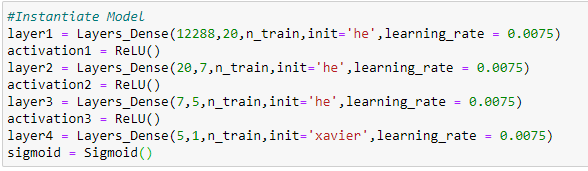
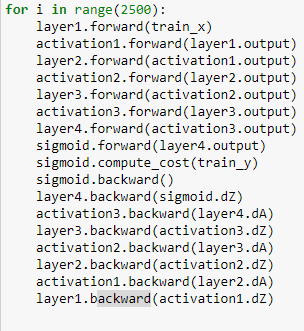
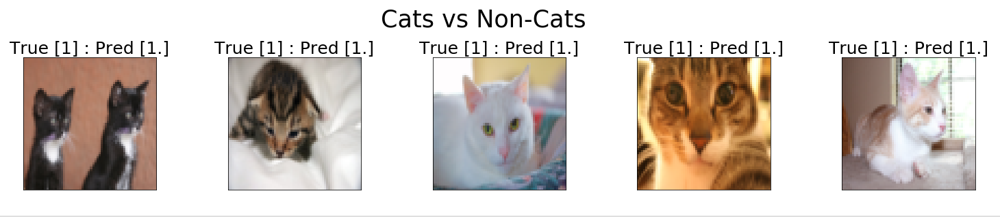

# Introduction
These days, building and training a deep learning model can actually be quite easy.  Libraries such as TensorFlow and PyTorch drastically simplify the process and almost entirely separate the engineer from the underlying mathematics of neural networks.  With that being said, this project is a bit of an ongoing learning enviornment for myself.  The main goal is to gain better intuition for neural networks by building one only using python and numpy. A secondary goal is to gain better understanding of Object Oriented Programming by building a NN OOP style. Lastly, I wanted to explore GPU acceleration by using CuPy.

# Usage
The main block of code is set up more or less to be like building blocks.  I am trying to emulate TensorFlow.  It definitely could use more work on that end because you need to explicitly call for the derivitaves to be calculated (don't need to do that in TF).  Any computer with Python 3 and Numpy installed can run the Numpy version.  The later half of the notebook uses CuPy which is a GPU accelerated version of Numpy methods built on top of CUDA.  It only works if you have an NVIDIA graphics card and CUDA installed.  More info here https://docs.cupy.dev/en/stable/index.html .

# Examples
#### Here is an example of model instantiation: 

#### Training Loop

#### Visualizing predictions
